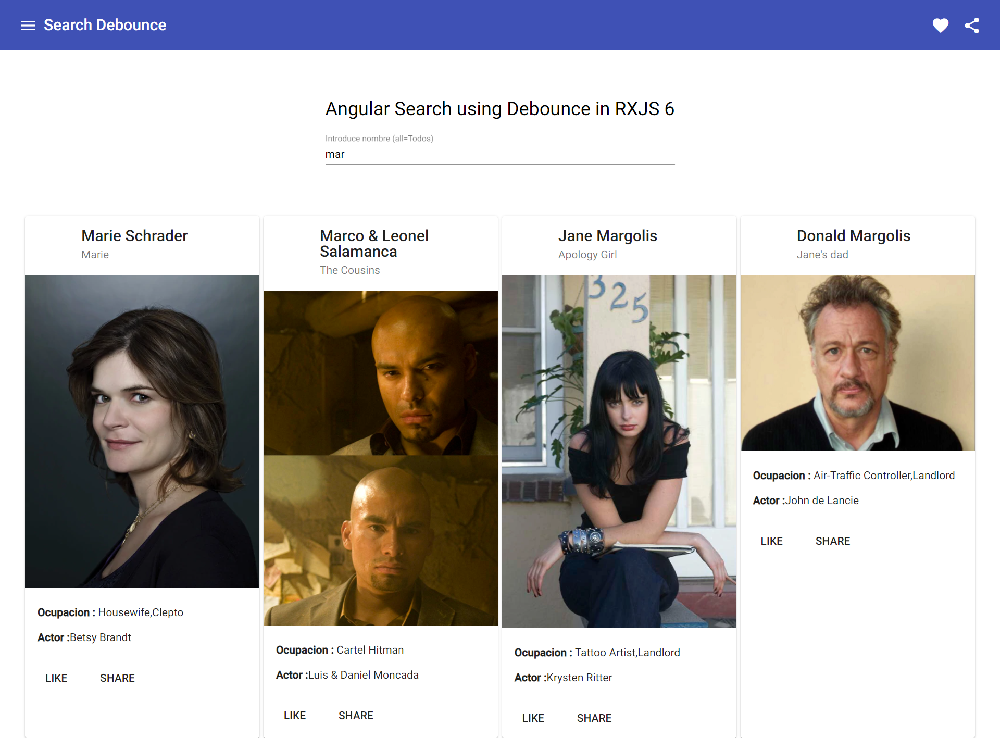

# AngularDebounceSearch

This project was generated with [Angular CLI](https://github.com/angular/angular-cli) version 11.2.10.

##  Para angular Universal tenemos que cambiar en introComponents 
```
mport { AfterViewInit, Component, ElementRef, ViewChild } from '@angular/core';
import { DOCUMENT } from '@angular/common';
import { Inject, Injectable, HostListener } from '@angular/core';
import { PLATFORM_ID } from '@angular/core';
import { isPlatformBrowser, isPlatformServer } from '@angular/common';
import {
  trigger,
  state,
  style,
  animate,
  transition,
  // ...
} from '@angular/animations';
@Component({
  selector: 'app-root',
  templateUrl: './app.component.html',
  styleUrls: ['./app.component.css'],
  animations: [
    trigger('minavbar', [
      // ...
      state('open', style({
        color: 'white',
        opacity: 1,
        position: 'fixed'
      })),
      state('closed', style({
        display: 'flex',


        height: '140px',
        width: '100%',
        color: 'white',
        opacity: 1,
        position: 'fixed',
        backgroundSize: '100%',
        backgroundRepeat: 'no-repeat',

        backgroundImage: 'url("/../../assets/images/minavbar.svg")'
      })),
      transition('open => closed', [
        animate('1s')
      ]),
      transition('closed => open', [
        animate('1s')
      ]),
      transition('open => close', [
        animate('0.5s')
      ]),
    ]),
    trigger('equipo', [
      // ...
      state('open', style({
        transform: 'translate(-100px)'
      })),
      state('closed', style({
        margin: '30px auto'
      })),
      transition('open => closed', [
        animate('1s')
      ]),
      transition('closed => open', [
        animate('1s')
      ]),
      transition('open => close', [
        animate('0.5s')
      ]),
    ]),
  ],
})
export class AppComponent implements AfterViewInit {
  @ViewChild('equipo', { static: false }) equipo!: ElementRef;
  scrollEquipo: number = 0;
  isOpen = true;
  activado: boolean;
  ngAfterViewInit() {
    this.scrollEquipo = this.equipo.nativeElement.offsetTop
    console.log(this.equipo.nativeElement.offsetTop)
  }
  @HostListener('document:scroll') onWindowScroll() {
    if (isPlatformBrowser(this.platformId)) {
      if (window.pageYOffset > 350) {
        this.isOpen = false;
      } else {
        this.isOpen = true;
      }

      if (window.pageYOffset > this.scrollEquipo - 900) {
        this.activado = false;
      } else { this.activado = true }
    }
    if (isPlatformServer(this.platformId)) {
      // Server only code.
    }


  }
  title = 'borrar';
  constructor(@Inject(DOCUMENT) private document: Document, @Inject(PLATFORM_ID) private platformId: Object) {
    this.activado = true;
  }

}
```
## Development server

Run `ng serve` for a dev server. Navigate to `http://localhost:4200/`. The app will automatically reload if you change any of the source files.

## Code scaffolding

Run `ng generate component component-name` to generate a new component. You can also use `ng generate directive|pipe|service|class|guard|interface|enum|module`.

## Build

Run `ng build` to build the project. The build artifacts will be stored in the `dist/` directory. Use the `--prod` flag for a production build.

## Running unit tests

Run `ng test` to execute the unit tests via [Karma](https://karma-runner.github.io).

## Running end-to-end tests

Run `ng e2e` to execute the end-to-end tests via [Protractor](http://www.protractortest.org/).

## Further help

To get more help on the Angular CLI use `ng help` or go check out the [Angular CLI Overview and Command Reference](https://angular.io/cli) page.
